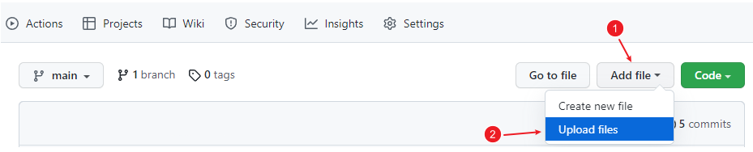
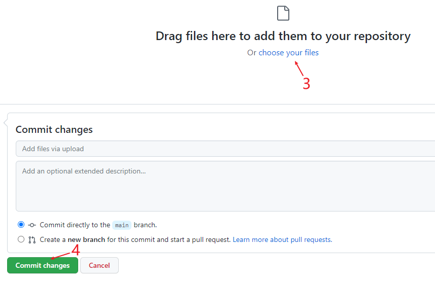
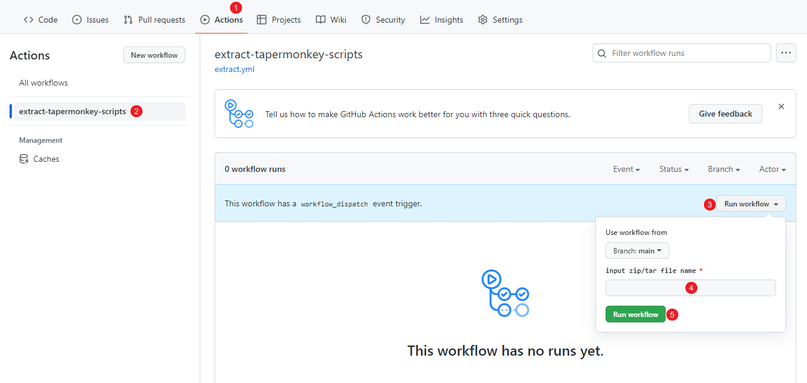

# restore your tapermonkey scripts by github action

this repo can restore tapermonkey scripts from its database(chrome leveldb).  
upload its database to the repo ,and run github action,
then the restored tapermonkey scripts will placed in result/ret.zip

## how to use?


### 1 pack your tapermonkey database to .zip or .tar  
path of tapermonkeyp data:
```text
# Linux:  "/home/<USERNAME>/.config/<BROWSER>/Default/Local Extension Settings/<EXTENSION_ID>"
# Mac : "/Users/<USERNAME>/Library/Application Support/Google/Chrome/Default/Local Extension Settings/<EXTENSION_ID>/"
#Windows chrome: "C:\Users\<USERNAME>\AppData\Local\Google\Chrome\User Data\Default\Local Extension Settings\<EXTENSION_ID>"
#windows edge:   "C:\Users\<USERNAME>\AppData\Local\Microsoft\Edge\User Data\Default\Local Extension Settings\<EXTENSION_ID>
```


### 2 fork the repository

### 3 upload the .zip or .tar file to the forked repo



### 4 run github action and specify the path to the zip/tar file 



### 5 wait a moment until action 
result: result/ret.zip  
log: github-action-run.log

### 6 download result/ret.zip